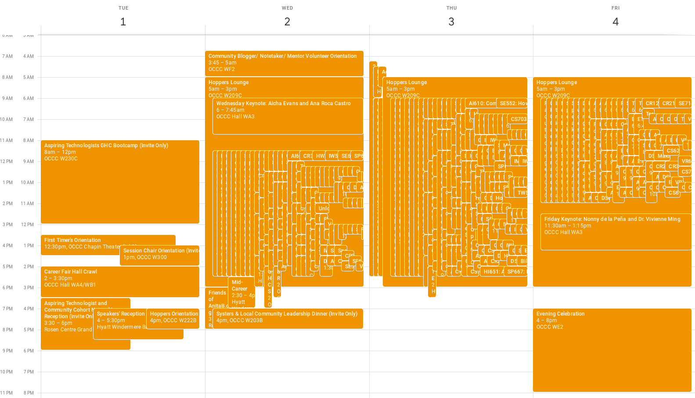

# autocalendar
Utilities for exporting to gCalendar. Head on over to the exporter if you already have the events you want, else use a scrapper provided (or the CSV output).

Be aware this may lead to your calendar being unreadable! Create a new one to avoid this :)

  

