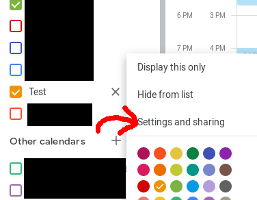
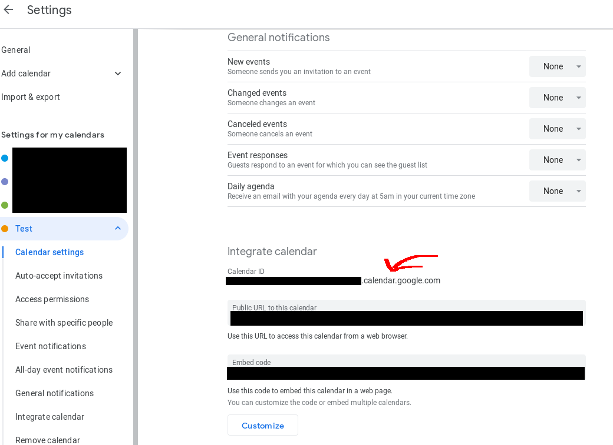

Steps:

0. Create a celendar if not done so
1. Create a gsheet with the csv
2. Insert your calendar ID from calendar settings

  

  

3. Massage your data with a text editor or web scraper to fit the gsheet. Make sure you follow [date standards](https://developers.google.com/chart/interactive/docs/datesandtimes#datetimes-using-the-date-constructor)
4. In gsheet go to tools->script editor. Paste gs code and run
