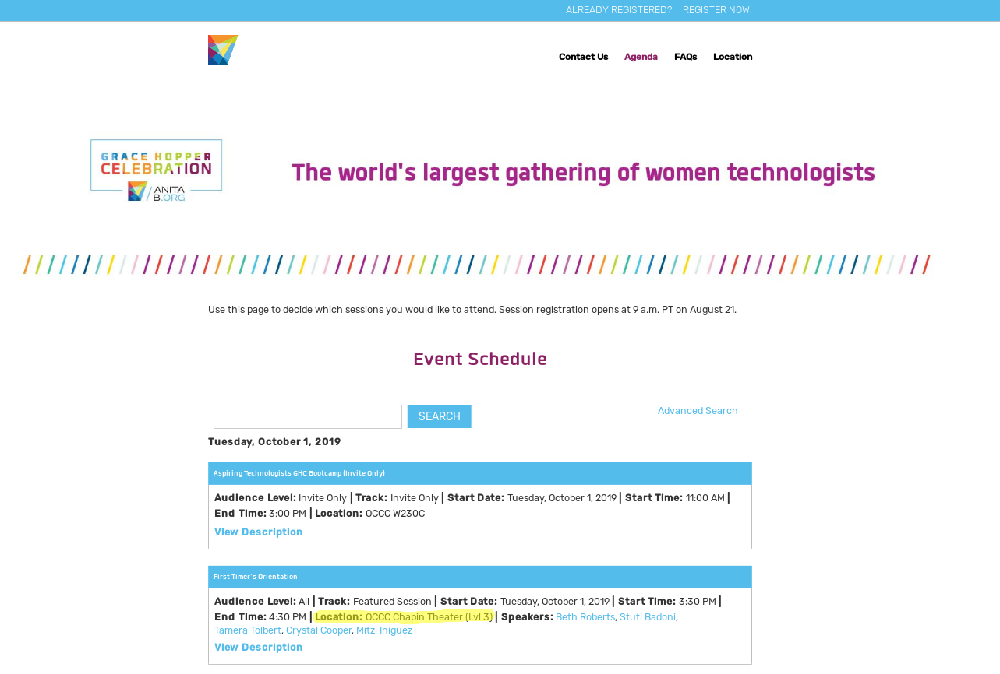

<h2>Installation notes for GHC19.py</h2>

Make sure you are looking at the screen with the location available!

  

Required modules:

<ul>
<li>Selenium
<li>Beautiful Soup
<li>RE
<li>Firefox (and Geckodriver)
</ul>

Commands for Majaro (Arch) linux:

    sudo pip install selenium
    sudo pip install bs4
    sudo pip install re
    sudo pacman -S geckodriver